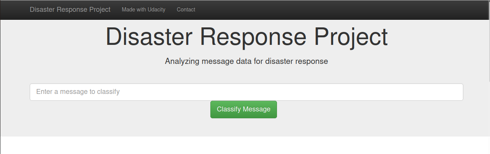

# Disaster-Response-Pipeline

### Introduction

This project refers to the Data Engineering part of the Udacity's Data Scientist Nanodegree Program.
It consists of a web app, where there is a trained model that classifies disaster messages and then it is possible to send the messages to an appropriate disaster relief agency.
The model was trained in a data set containing real messages that were sent during disaster events.

### Installation

To use this repository you only need to run the code using Python 3 versions.

### How to run
Run the following commands:
- Run a script that cleans data and stores in database:

```
python3 data/process_data.py data/messages.csv data/categories.csv data/ELT_Preparation.db
```

- Run a script that trains a classifier and saves in a pickle file:

```
python3 models/train_classifier.py data/ELT_Preparation.db models/classifier.pkl
```

- Run the last script to visualize the web app:

```
python3 app/run.py
```

- Go to http://0.0.0.0:3001/

### The Web App

Once you have done the steps above, you will visualize the web page:



There you can type a message, and than you can see the classification of this message.
Besides this, there are tree visualizations, where you can see the Categories Distribution in witch of the genres news, direct and social.

### Acknowledgements
I would like to thank Udacity for the Data Scientist program and to Figure Eight for providing the dataset. Feel free to use the analysis!

